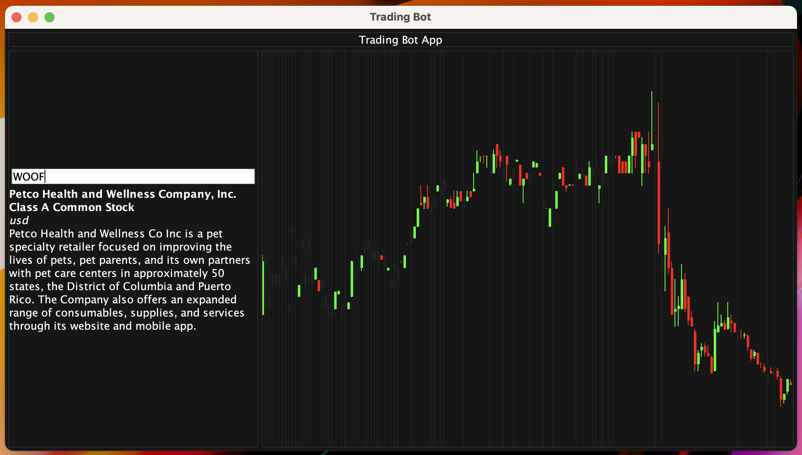

# Trading Bot - CS2114 Project 1

- Trading API: [Massive.com](https://massive.com/docs)

Create a simple bot that can make and manage trades

<div algin="center">
  
</div>

## Usage

Needs to be built (or see [releases](https://github.com/BaguSubash1/trading-bot/releases) for the latest build - none currently available)

Create a `.env` file in the same directory as the `.jar` file with the following environmental variables,

```.env
api_key={YOUR_MASSIVE_API_KEY}
```

## To-do

- [x] Sign up for API
- [ ] *Currently* - reading through / learning API
    - [x] Get 1 stock to show up on the terminal
- [x] Make the candle stick things
    - [ ] Add dates / time and grid-lines
    - [ ] Make scrollable
- [x] JSON parser for responses
- [x] Test out the API without a bot
    - [x] Create a dashboard
    - [ ] Make non-autonomous trades for the dashboard
- [ ] Create the bot

## Notes

> [!WARNING]
> This is outdated, these methods return `JSON<?>` objects.

Built a few helper functions for requesting things from the API, see [`MassiveClient`](com/bot/massive/MassiveClient.java)

```java
// Example Request to get a ticker
final MassiveClient.Response<Ticker> response = massive_client.get_ticker(new Queryable() {
  String market = "stocks";
  boolean active = true;
  String order = "asc";
  int limit = 1;
});
```

This code sends a request to the following url, and parses the response into a `MassiveClient.Response<Ticker>` object.

```
https://api.massive.com/v3/reference/tickers?market=stocks&active=true&order=asc&limit=1&apiKey=*************
```

> [!NOTE]
> I am still working on the complete implementation of endpoints

## Deliverables

- [Deliverable 1](https://docs.google.com/document/d/1h_lPv4-y-MJmq0EvWo9_2c5j4hwAc-DDNpUwC_O64Yk/edit?usp=sharing)